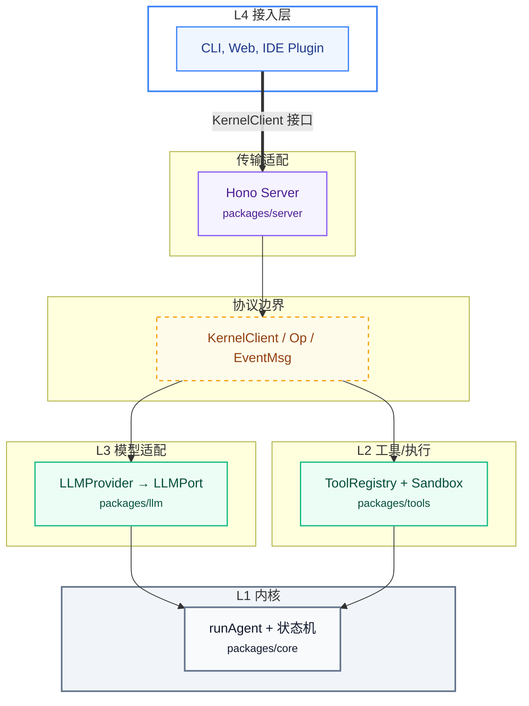

<div align="center">
    
</div>

<br/>

<div align="center">

<!-- 核心与后端 -->


<br />
<!-- 前端开发 -->


<br />
<!-- 构建与工程化 -->


</div>

<br/>

## 一、关于 Liskin

Liskin 是一款专注研发提效的 Coding Agent。产品目前提供 IDE 插件，web和 CLI 多种形态，主要解决的是通用编程 Agent 在大型代码库里反复暴露的几个老问题：

- 看不懂代码库。通用 Agent 对大型工程缺乏全局认知，回答经常跑偏，开发者只能不停追问、手动补约束。

- 其次是生成的代码不合规范，常常偏离业务逻辑或 UI 标准，存在幻觉，设计稿还原得也不理想。

- 复杂任务接不住——单轮 Agent 既缺上下文也缺工具，跨模块、多步骤的活难以完成。

- 质量缺乏反馈，代码写完没有客观评估，开发者对产出好坏没有把握。

## 二、相对业界主流 Agent 的技术创新

### 深度代码检索

Liskin 用 Code RAG 配合基于 LSP AST 的代码索引做跨文件检索，把准确的上下文主动喂给模型，而不是让模型盲猜，也省去了开发者手动粘贴代码片段的环节。这套检索能力后续计划做 MCP 化，作为标准工具服务对外开放。

### 单 Agent 全程上下文与无痕微压缩

主流的多 Agent 编排有一个共性缺陷，Liskin 早期的 Subagent 串联也踩过这个坑：每个子 Agent 各自维护记忆，切换时上下文就断了。

Liskin 换了思路，借鉴 Claude Skills 的渐进式披露，以及 Manus、Claude Code 的微压缩机制，让单个 Agent 在一次任务里全程保持完整上下文，只在阶段之间做无痕微压缩。这样既压住了上下文膨胀，又保住了对话的连续性。实测显示，引入渐进式加载后 Token 消耗下降约 50%，平均任务完成时间缩短约 50%，指令遵循度提升约 7%。这条路线与 Cursor、Trae 的多 Agent 编排有明显区别。

### 双模式 + Auto 智能路由

业界产品大多用一个 Agent 应对所有任务，比如 Cursor 的单 Agent、Windsurf 的 Cascade 全自动流。Liskin 走的是另一条路：把深度规划和快速执行拆成两个独立的执行模式，二者在 LLM 选型、Prompt 策略、工具集和上下文管理上完全分开，而每个模式内部仍由单个 Agent 全程持有上下文。

上层的 Auto 路由会根据任务复杂度和需求明确度自动分发——复杂的架构性任务交给深度规划，明确的单点修改交给快速执行。这样"PRD 到架构拆解"和"即时 Bugfix"这两类差异极大的任务都能稳定接住，而不是拿同一套配置硬扛到底。

### 架构创新与云端-本地协同

产品以一个统一内核为中心，对外提供 Web、CLI、IDE 插件乃至移动端 App 等多种客户端，开发者在任意终端都能随时开工。再通过 MCP 打通 GitHub、Vercel、Cloudflare 等开发与部署链路，把研发流程串成一个闭环。

这套架构的关键在于内核与外壳解耦。同一份内核代码靠不同的 KernelClient 适配多端——CLI 走 InProcessKernelClient，Web 走 HttpSseKernelClient，未来 IDE 走 JsonRpcKernelClient；而 Claude Code 的 VSCode 扩展和 CLI 是两条相对独立的实现路径。内核并不知道自己是被 CLI、Web 还是 IDE 调用的——LLMPort、ToolPort、StorePort 三个端口接口让内核只跟抽象契约打交道，换模型、换工具来源、换存储后端，都不必改动内核代码。这个设计便于日后的插件化扩展

新增Sandbox，路径白名单加命令黑名单，再配合 auto/ask/deny 三档确认策略，权限粒度比 Claude Code 更细。

### Harness 框架支撑长程任务自迭代

Harness 是 Liskin 专为复杂长程任务设计的执行框架。它把任务拆成可中断、可恢复、可审计的节点序列，用 Markdown 文件落盘记录意图、阶段、闸门和完成状态。借助它，Agent 在多轮执行中能够始终对齐目标，即便中途中断，也能从断点精确接回。其长任务可中断、可恢复、可审计，状态落盘在 `.liskin/harness/` 目录，这是 Claude Code 目前没有的机制。

### 评测驱动迭代

Liskin 建立了一套系统化的 Agent 评测机制，并把行为日志结构化成 RLHF/DPO 训练数据，形成 post-coding 数据飞轮。依托评测持续发现并改进 System Prompt、链路、工具和模型上的问题。

### 在建能力

D2C 是当前的核心抓手，配合 AGENTS.md 的项目级规范注入和 Harness 真相文档，把业务规则与 UI 标准显式传给模型，不再依赖模型自行揣摩。围绕落地链路，还在推进 GitHub CI/CD、Vercel、Cloudflare 等平台从 SCM 研发到上线部署的全流程集成，以及基于 ContextDB 的上下文管理集成和文档形式的 stage 管理。

## 三、与 Claude Code / Trae / Cursor 的对比

| 维度        | Claude Code                         | Liskin                                         |
| ----------- | ----------------------------------- | ---------------------------------------------- |
| 多端支持    | 本地 CLI / VSCode 扩展              | CLI + Web + IDE 插件，共用同一 daemon          |
| Provider    | 仅 Anthropic API                    | 原生支持多 Provider 热切换                     |
| 上下文工程  | 系统 Prompt + 项目记忆              | 同样支持 AGENTS.md，外加 Harness 工程基础设施  |
| 工具系统    | 内置工具（Bash/Read/Write/Edit 等） | 内置 fs/shell + Sandbox 防护 + 可扩展 ToolPort |
| 多 Provider | 仅 Anthropic 模型                   | 动态 Provider 路由，Web UI 切换，配置持久化    |

当然，Claude Code 在 System Prompt 与工具链的打磨、PR/Issue 评论和 CI 集成等企业协作能力上更为成熟，这些是 Liskin 后续需要补齐的方向。

---

# 架构设计 Kernel ↔ Client

内核（Agent 状态机 + 工具 + 模型适配）与调用方（CLI / Web / IDE）进行解耦

内核不感知调用内核的对象，越靠内的层越稳定。

四层单向依赖的架构



| 包                | 层  | 职责                                                                               |
| ----------------- | --- | ---------------------------------------------------------------------------------- |
| `packages/core`   | L1  | Agent 状态机、主循环、Op/EventMsg 协议、KernelClient 接口                          |
| `packages/tools`  | L2  | 工具注册 + 沙箱（路径白名单/危险命令拦截）、fs.read/fs.write/shell.exec            |
| `packages/llm`    | L3  | LLMProvider 接口 + OpenAI 兼容适配器（已验证 GLM5.2）                              |
| `packages/server` | L4  | Hono daemon，HTTP/SSE + SQLite 持久化                                              |
| `client/`         | L4  | CLI 入口：agent serve（daemon）、agent exec（headless）、agent chat（交互式 REPL） |
| `web/`            | L4  | React + Vite + Tailwind 前端（待重写为时间线渲染）                                 |

---

### 依赖边界

通过 `dependency-cruiser` 强制执行单向依赖规则：`core` 不依赖 `tools/llm/server`，`tools` 不依赖 `llm/server`，依此类推。任何反向 import 在 `pnpm deps:check` 阶段直接阻塞。

### 前端

| 类别       | 选型                                      | 用途                                                |
| ---------- | ----------------------------------------- | --------------------------------------------------- |
| 框架       | React + TypeScript                        | SPA，Vite 构建                                      |
| 路由       | react-router                              | 客户端路由，非 Next 文件路由                        |
| 远端状态   | SWR                                       | 请求缓存、重试、revalidate                          |
| 本地状态   | Zustand                                   | 跨组件共享，替代 Redux                              |
| 局部状态   | React hooks + ahooks                      | 页面/组件级交互                                     |
| 样式       | TailwindCSS + cva + clsx + tailwind-merge | 原子化 + 变体管理                                   |
| 无样式组件 | Radix UI                                  | Dialog、Select、Tooltip 等                          |
| 业务组件   | HeroUI                                    | 快速搭建（待 React 19 + Tailwind 4 升级后深度启用） |
| 动画       | Framer Motion                             | 过渡与手势                                          |
| 通知       | Sonner                                    | Toast 通知                                          |

### 编辑与内容渲染

| 类别       | 选型                                      |
| ---------- | ----------------------------------------- |
| Markdown   | react-markdown + remark-gfm + rehype 系列 |
| 图表       | mermaid                                   |
| 代码编辑   | monaco-editor + @monaco-editor/react      |
| 节点流程图 | reactflow                                 |

---

## 快速开始

### 前置

- Node ≥ 20、pnpm 9
- 一个 LLM API Key（OpenAI 兼容协议；）

```bash
# 克隆代码仓库
git clone https://github.com/Zhongye1/liskin.git

pnpm install
pnpm -r run build

cp .env.example .env
# 编辑 .env，填入 OPENAI_API_KEY（填入你的 API 地址和模型）
```

### 3) 跑任务（agent exec，in-process，无 daemon）

```bash
./scripts/dev.sh exec "用 matplotlib 画个柱状图存到 output/bar.png 并写 README 附图"
# 指定工作目录与最大轮数
./scripts/dev.sh exec "..." --cwd /tmp/my-task --max-turns 30
```

`agent exec` 用 `InProcessKernelClient` 直连内核，auto 批准工具，实时渲染事件流到终端，跑完即退出。事件流包含 `Token`（流式文本）、`ToolCall`/`ToolProgress`/`ToolResult`（工具调用 + 实时 stdout/stderr）、`TurnEnd`（回合结束）。

### 4) 交互式 REPL（agent chat，in-process，无 daemon）

```bash
# 最简启动（确认策略默认 ask）
pnpm run cli

./scripts/dev.sh chat

# 指定模型和自定义 system prompt
./scripts/dev.sh chat --model gpt-4o --system "你是 Python 专家"

# 关闭工具确认（全自动执行）
./scripts/dev.sh chat --confirm auto

# 不持久化（退出即丢会话）
./scripts/dev.sh chat --no-save

# 恢复之前保存的会话
./scripts/dev.sh chat --resume <sessionId>

# 使用第三方 API
./scripts/dev.sh chat --base-url https://api.openrouter.ai/v1 --model anthropic/claude-sonnet-4
```

`agent chat` 同样用 `InProcessKernelClient` 直连内核，与 `exec` 共享同一套渲染函数。核心差异：

- **多轮对话**：readline REPL 循环，持续交互直到 `/exit`
- **工具确认**：默认 `ask`，终端内联 `[y/n]` 问询（可用 `--confirm auto` 关闭）
- **持久化**：默认存到 `~/.liskin/chat-sessions.sqlite`，`--resume` 恢复
- **中断**：Ctrl-C 中断当前 turn 回到 prompt（不同于 exec 直接退出）

REPL 内置命令：

| 命令        | 作用             |
| ----------- | ---------------- |
| `/exit`     | 退出 REPL        |
| `/help`     | 打印帮助信息     |
| `/sessions` | 列出已保存的会话 |

### 5) 启动全栈（agent serve + web）

```bash
./scripts/dev.sh          # 构建 + 启动 server(8787) + web(5173)
./scripts/dev.sh --no-build   # 跳过构建
./scripts/dev.sh stop         # 停止
./scripts/dev.sh logs         # 看日志
./scripts/dev.sh watch     # 并行 tsup watch（core/tools/llm/server/client） 开发用
```

### CLI

```bash
# headless 一次性任务（已验证闭环）
agent exec --model opensource/glm5.2 --base-url https://api.openai.com/v1 \
 --cwd /tmp/task "你的任务"

# 起 daemon（给 Web 用）
agent serve --port 8787 --cwd /your/workspace --cors http://localhost:5173
```

# 当前进度

Phase 0 已闭环。五个核心包全部可构建、可测试，端到端通路已验证。

### 已交付

**M0 — monorepo 骨架。** pnpm workspace 立起五个包，共享 tsconfig，dependency-cruiser 守住架构红线，oxlint/prettier/commitlint 工具链完整。

**M1 — Agent Core 状态机。** `runAgent` 异步生成器驱动主循环：idle → streaming → awaiting_tool → awaiting_user → done。`LLMPort` / `ToolPort` / `StorePort` 三个端口接口定义在内核中，具体实现在外层注入。`HarnessPort` 接口预留，NoopHarness 占位。6 个单测覆盖纯对话、工具回灌、确认门、maxTurns 保护、错误传播、取消信号。

**M2 — OpenAI Provider。** `OpenAIProvider implements LLMPort`，覆盖 SSE 流式解析、按 index 增量拼接 tool_call、Msg/ToolDef ↔ OpenAI 协议互转、错误归一化（API 错误 / 网络错误 / 流异常 / 取消）。`createProvider` 工厂函数支持动态路由。30 个单测。

**M3 — 工具系统 + 沙箱。** `ToolRegistry implements ToolPort`，zod schema 校验。内置 `fs.read`（行号范围）、`fs.write`（diff 预览）、`shell.exec`（sh -c 管道）。Sandbox 三层：路径白名单（防路径穿越）、命令黑名单（9 条危险模式）、确认策略（auto/ask/deny）。`ConfirmRequiredError` 携带 callId 支持外部确认回灌。40 个单测。

**M4 — 接入层 + CLI + Web。** `packages/server`：Hono daemon，POST /v1/chat SSE 端点，SQLite 持久化。动态 Provider 路由，Web UI 可配置多服务商、热切换、API key 掩码。`client/`：CLI 入口，`agent serve` 启 daemon，`agent exec` 一次性任务。`web/`：React 前端，SSE AgentEvent 消费，工具调用面板，确认弹窗，ProviderSettings 配置面板。

**累计**：88 个测试（14 个文件），全仓 typecheck / build / lint / deps:check 通过。

### 遗留

`server/`（Go + Gin + faasrouter + Thrift IDL）暂时搁置，Phase 2 后端需时开始进行评估。

---

## 接下来的工作

按优先级排列，每条支线相互独立，可按需切入。

### 1. 收尾清理

- 前端 MVP 样式优化
- 清掉未使用的依赖（@radix-ui 部分组件、ahooks、axios、swr、usehooks-ts）
- bundle 拆分：react-markdown / highlight.js 改用 dynamic import，消除 614KB chunk
- 修复 lint-staged 在部分环境下的 stash-restore 异常

### 2. MCP 协议支持

Phase 1 价值最大的一项。接入 Model Context Protocol，让 agent 能消费外部工具和数据源（stdio 和 HTTP 两种 transport）。内核的 `ToolPort` 已为此预留接口——MCP 客户端只需作为 `ToolPort` 的另一个实现注入，内核零改动。

### 3. 多 Provider 扩展

当前 LLM 层只有 OpenAI 兼容适配器。`LLMPort` 接口天然支持新增 Anthropic 等 Provider。`dynamic-llm.ts` 已有骨架，主要是 `packages/llm` 内加适配器实现。

### 4. 项目记忆

让 agent 读取并遵守项目根目录的 `AGENTS.md` 约定文件。内容按层级组织：根目录放全局规范（架构、编码规范、Agent 路由决策树），业务目录放模块知识。记忆文件只描述"在哪查、怎么查"，不存易变数据。

### 5. 终端 UI 增强

`agent chat` 交互式 REPL 已交付（Phase 1，基于 Node readline 原生实现，零新依赖）。后续增强方向：ANSI 光标控制（流式输出时隐藏光标、spinner 动画）、输入历史（readline history 持久化）、多行输入（粘贴代码块）。不引入 Ink/React 等重型 TUI 框架，保持 CLI 轻量。

### 6. Harness 框架

将 `NoopHarness` 替换为 `MarkdownHarness`：复杂任务自动在 `.liskin/harness/active/` 下创建 Markdown 任务文档，记录用户意图、待办节点、已完成节点、闸门、控制状态。每个工具调用闭环后落盘节点结果。目标：任务中断能续跑、长任务可审计、执行过程可回溯。

### 7. 沙箱执行加固

- `--sandbox` 标志，接入 OS 级隔离（Linux bubblewrap / macOS sandbox-exec）
- 写/删文件前的 diff 预览
- 撤销栈

---

## 阶段路线图

### Phase 0（已完成）

单体本地 Agent 跑通端到端：用户对话 → 模型流式输出 → 工具调用 → 沙箱确认 → 执行 → 结果回灌 → 继续对话 → 完成。

Web UI、CLI、Hono daemon 全部到位。

### Phase 1（当前阶段）

目标：终端常驻可用，覆盖 80% 日常编码需求。

1. **Agent Loop 完善**：Read → Plan → Act → Verify 循环，工具集扩展（read_file、write_file、run_shell、list_files、grep、edit）
2. **沙箱隔离**：OS 级机制（Landlock/seccomp）限制文件系统和网络访问，默认最小权限，按需扩展
3. **项目感知**：读取 `AGENTS.md` 和项目配置文件，构建指令链，让 Agent 理解项目结构和约定
4. **审批机制**：多级审批（只读→需确认→全自动），可编程 hook 系统拦截生命周期事件
5. **工具协议标准化**：MCP 客户端消费外部工具，工具 schema 以 JSON Schema 传给模型，支持 stdio 和 HTTP 两种 transport
6. **上下文管理**：自动压缩（compaction），session 持久化和恢复，上下文健康度监控

### Phase 2

7. **可观测性**：结构化日志（JSONL session transcripts），OpenTelemetry Tracing，Token 用量计量
8. **多 Agent 协作**：子 Agent 定义（TOML），并行执行 + 结果聚合，MCP Server 模式（自身也能被其他 agent 调用）

### Phase 3+

9. **后端网关**：Key 托管、多用户、审计、限流（激活 `server/` Go 代码）
10. **IDE 插件**：VSCode / JetBrains 插件，连接同一个 `agent serve` daemon
11. **工作流编排**：多 Agent DAG 执行。设计文档明确警告——不要把 Agent 多步骤误当成工作流引擎，不要把 Harness 当 DAG 节点。

---

## 其他

参考资料： 构建AGENT 一般roadmap

Step 1：确定 Agent Loop
实现 Read → Plan → Act → Verify 循环
给模型配备工具：read_file、write_file、run_shell、list_files

Step 2：沙箱隔离
用 OS 级机制（Landlock/seccomp/Seatbelt）限制文件系统和网络
默认最小权限，按需扩展

Step 3：项目感知
读取 AGENTS.md/ 项目配置文件
构建指令链（instruction chain）

Step 4：审批机制
实现多级审批模式（从只读到全自动）
提供可编程的 hook 系统拦截生命周期事件

Step 5：工具协议
实现 MCP 客户端（消费外部工具）
将工具 schema 作为 JSON schema 传给模型
支持 stdio 和 HTTP 传输

Step 6：上下文管理
实现自动压缩（compaction）
支持 session 持久化和恢复
监控上下文健康度

Step 7：可观测性
结构化日志（JSONL session transcripts）
Tracing（OpenTelemetry 导出）
Token 计量

Step 8：多代理扩展
子代理定义（TOML 格式）
并行执行 + 结果聚合
MCP Server 模式（让自己也能被其他 agent 调用）
