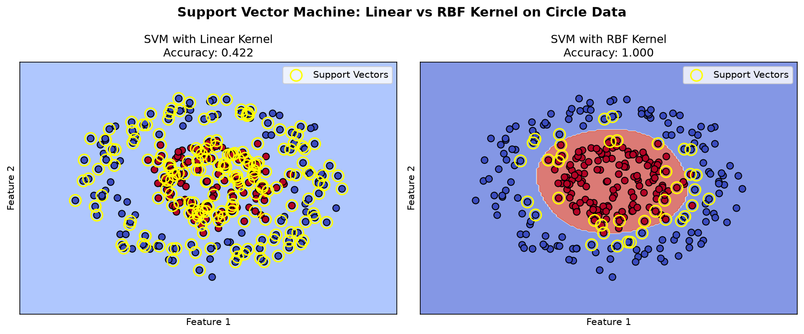

---
./scripts/dev.sh exec "在本地新建testrange路径，加入gitignore，写一个支持向量机的代码并且可视化结果，生成图片，再新建文档把图片和描述放进去"

这是创建结果：
---

# 支持向量机（SVM）可视化演示

本目录包含一个完整的支持向量机二分类可视化示例，对比了**线性核（Linear Kernel）**与**RBF 核（高斯径向基核）**在非线性可分数据集上的表现。

## 运行方式

```bash
# 安装依赖
pip install numpy matplotlib scikit-learn

# 运行脚本
python svm_demo.py
```

## 实验说明

### 数据集

使用 `sklearn.datasets.make_circles` 生成**环形分布**的两类数据（300 个样本，含噪声），这是一个典型的**线性不可分**数据集。

### 模型对比

| 模型 | 核函数           | 测试集准确率 |
| ---- | ---------------- | ------------ |
| SVM  | Linear（线性核） | 约 42%       |
| SVM  | RBF（高斯核）    | 100%         |

### 决策边界可视化



### 结果分析

1. **线性核 SVM**：由于数据是环形分布，线性核无法找到一条直线将两类分开，准确率很低（约 42%），这正是"线性不可分"的体现。

2. **RBF 核 SVM**：通过核技巧（Kernel Trick）将数据映射到高维特征空间，在高维空间中变成线性可分，最终在原始空间中形成非线性的圆形决策边界，完美分离两类数据（准确率 100%）。

3. **支持向量**：图中黄色空心圆圈标记的就是支持向量——它们是决定决策边界位置的关键样本，SVM 只依赖这些少量关键样本进行分类。

## 关键知识点

- **核技巧**：SVM 通过核函数隐式地将数据映射到高维空间，避免了显式计算高维特征，大幅降低计算开销。
- **支持向量**：只有落在间隔边界上或分类错误的样本才会影响决策边界，其余样本可以被忽略。
- **超参数**：
  - `C`：正则化参数，控制误分类惩罚程度
  - `gamma`（RBF 核特有）：控制单个训练样本的影响范围，值越大决策边界越复杂
